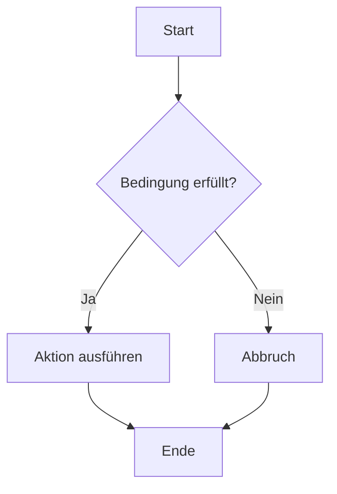

# Peters Workshop project
## Intro
My first **project** and *excercise*
## next step
- [ ] fullfil my README
- [ ] Create Sourcecode
- [ ] Test ist

```mermaid
graph TD
    A[Start] --> B{Bedingung erfüllt?}
    B -->|Ja| C[Aktion ausführen]
    B -->|Nein| D[Abbruch]
    C --> E[Ende]
    D --> E
```
